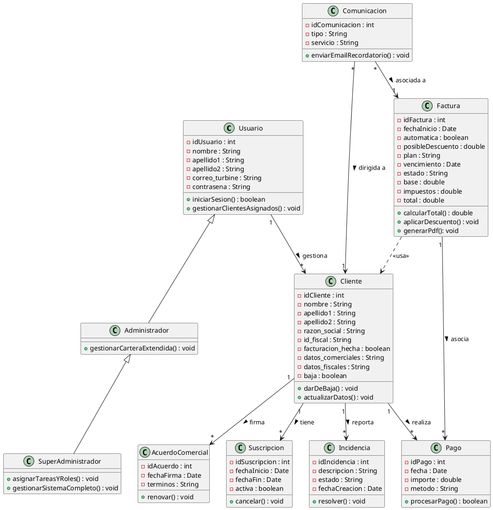

```plantuml
@startuml

class Usuario {
  - idUsuario : int
  - nombre : String
  - apellido1 : String
  - apellido2 : String
  - correo_turbine : String
  - contrasena : String
  + iniciarSesion() : boolean
  + gestionarClientesAsignados() : void
}

class Administrador {
  + gestionarCarteraExtendida() : void
}

class SuperAdministrador {
  + asignarTareasYRoles() : void
  + gestionarSistemaCompleto() : void
}

Usuario <|-- Administrador
Administrador <|-- SuperAdministrador


class Cliente {
  - idCliente : int
  - nombre : String
  - apellido1 : String
  - apellido2 : String
  - razon_social : String
  - id_fiscal : String
  - facturacion_hecha : boolean 
  - datos_comerciales : String
  - datos_fiscales : String
  - baja : boolean
  + darDeBaja() : void
  + actualizarDatos() : void
}

class Factura {
  - idFactura : int
  - fechaInicio : Date
  - automatica : boolean
  - posibleDescuento : double
  - plan : String
  - vencimiento : Date
  - estado : String
  - base : double
  - impuestos : double
  - total : double
  + calcularTotal() : double
  + aplicarDescuento() : void
  + generarPdf(): void
}

class Pago {
  - idPago : int
  - fecha : Date
  - importe : double
  - metodo : String
  + procesarPago() : boolean
}

class Comunicacion {
  - idComunicacion : int
  - tipo : String
  - servicio : String
  + enviarEmailRecordatorio() : void
}

class Incidencia {
  - idIncidencia : int
  - descripcion : String
  - estado : String
  - fechaCreacion : Date
  + resolver() : void
}

class AcuerdoComercial {
  - idAcuerdo : int
  - fechaFirma : Date
  - terminos : String
  + renovar() : void
}

class Suscripcion {
  - idSuscripcion : int
  - fechaInicio : Date
  - fechaFin : Date
  - activa : boolean
  + cancelar() : void
}

Usuario "1" --> "*" Cliente : gestiona >
Factura ..> Cliente : <<usa>>

Cliente "1" --> "*" Pago : realiza >
Factura "1" --> "*" Pago : asocia >

Comunicacion "*" --> "1" Cliente : dirigida a >
Comunicacion "*" --> "1" Factura : asociada a >

Cliente "1" --> "*" Incidencia : reporta >
Cliente "1" --> "*" AcuerdoComercial : firma >
Cliente "1" --> "*" Suscripcion : tiene >

@enduml
```