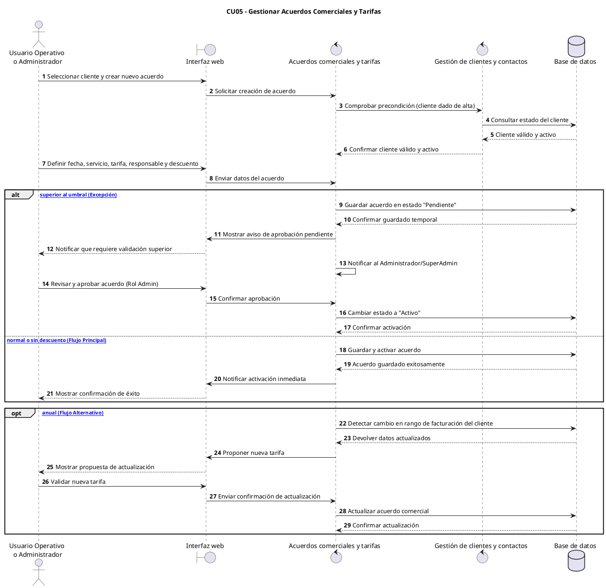

# CU05 - Gestionar Acuerdos Comerciales y Tarifas

## Diagrama de Secuencia (PlantUML)

```plantuml
@startuml
autonumber
title CU05 - Gestionar Acuerdos Comerciales y Tarifas

actor "Usuario Operativo \no Administrador" as Usuario
boundary "Interfaz web" as Interfaz
control "Acuerdos comerciales y tarifas" as Acuerdos
control "Gestión de clientes y contactos" as Clientes
database "Base de datos" as BD

Usuario -> Interfaz : Seleccionar cliente y crear nuevo acuerdo
Interfaz -> Acuerdos : Solicitar creación de acuerdo
Acuerdos -> Clientes : Comprobar precondición (cliente dado de alta)
Clientes -> BD : Consultar estado del cliente
BD --> Clientes : Cliente válido y activo
Clientes --> Acuerdos : Confirmar cliente válido y activo

Usuario -> Interfaz : Definir fecha, servicio, tarifa, responsable y descuento
Interfaz -> Acuerdos : Enviar datos del acuerdo

alt [Descuento superior al umbral (Excepción)]
    Acuerdos -> BD : Guardar acuerdo en estado "Pendiente"
    BD --> Acuerdos : Confirmar guardado temporal
    Acuerdos -> Interfaz : Mostrar aviso de aprobación pendiente
    Interfaz --> Usuario : Notificar que requiere validación superior
    Acuerdos -> Acuerdos : Notificar al Administrador/SuperAdmin
    
    Usuario -> Interfaz : Revisar y aprobar acuerdo (Rol Admin)
    Interfaz -> Acuerdos : Confirmar aprobación
    Acuerdos -> BD : Cambiar estado a "Activo"
    BD --> Acuerdos : Confirmar activación

else [Descuento normal o sin descuento (Flujo Principal)]
    Acuerdos -> BD : Guardar y activar acuerdo
    BD --> Acuerdos : Acuerdo guardado exitosamente
    Acuerdos -> Interfaz : Notificar activación inmediata
    Interfaz --> Usuario : Mostrar confirmación de éxito
end

opt [Revisión anual (Flujo Alternativo)]
    Acuerdos -> BD : Detectar cambio en rango de facturación del cliente
    BD --> Acuerdos : Devolver datos actualizados
    Acuerdos -> Interfaz : Proponer nueva tarifa
    Interfaz --> Usuario : Mostrar propuesta de actualización
    Usuario -> Interfaz : Validar nueva tarifa
    Interfaz -> Acuerdos : Enviar confirmación de actualización
    Acuerdos -> BD : Actualizar acuerdo comercial
    BD --> Acuerdos : Confirmar actualización
end

@enduml
```
