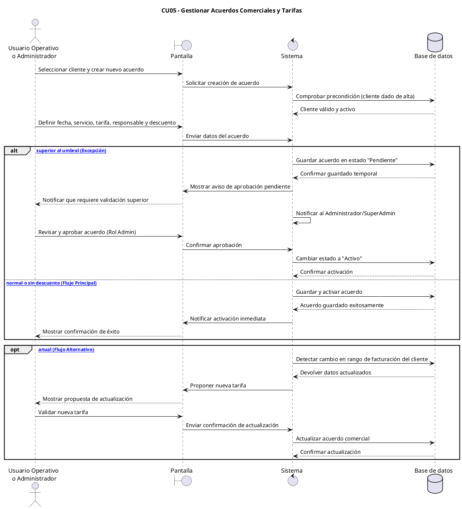

# Diagrama de Secuencia - CU05: Gestionar Acuerdos Comerciales y Tarifas

```plantuml
@startuml
title CU05 - Gestionar Acuerdos Comerciales y Tarifas

actor "Usuario Operativo \no Administrador" as Usuario
boundary "Pantalla" as Pantalla
control "Sistema" as Sistema
database "Base de datos" as BD

Usuario -> Pantalla : Seleccionar cliente y crear nuevo acuerdo
Pantalla -> Sistema : Solicitar creación de acuerdo
Sistema -> BD : Comprobar precondición (cliente dado de alta)
BD --> Sistema : Cliente válido y activo

Usuario -> Pantalla : Definir fecha, servicio, tarifa, responsable y descuento
Pantalla -> Sistema : Enviar datos del acuerdo

alt [Descuento superior al umbral (Excepción)]
    Sistema -> BD : Guardar acuerdo en estado "Pendiente"
    BD --> Sistema : Confirmar guardado temporal
    Sistema -> Pantalla : Mostrar aviso de aprobación pendiente
    Pantalla --> Usuario : Notificar que requiere validación superior
    Sistema -> Sistema : Notificar al Administrador/SuperAdmin
    
    Usuario -> Pantalla : Revisar y aprobar acuerdo (Rol Admin)
    Pantalla -> Sistema : Confirmar aprobación
    Sistema -> BD : Cambiar estado a "Activo"
    BD --> Sistema : Confirmar activación

else [Descuento normal o sin descuento (Flujo Principal)]
    Sistema -> BD : Guardar y activar acuerdo
    BD --> Sistema : Acuerdo guardado exitosamente
    Sistema -> Pantalla : Notificar activación inmediata
    Pantalla --> Usuario : Mostrar confirmación de éxito
end

opt [Revisión anual (Flujo Alternativo)]
    Sistema -> BD : Detectar cambio en rango de facturación del cliente
    BD --> Sistema : Devolver datos actualizados
    Sistema -> Pantalla : Proponer nueva tarifa
    Pantalla --> Usuario : Mostrar propuesta de actualización
    Usuario -> Pantalla : Validar nueva tarifa
    Pantalla -> Sistema : Enviar confirmación de actualización
    Sistema -> BD : Actualizar acuerdo comercial
    BD --> Sistema : Confirmar actualización
end

@enduml
```